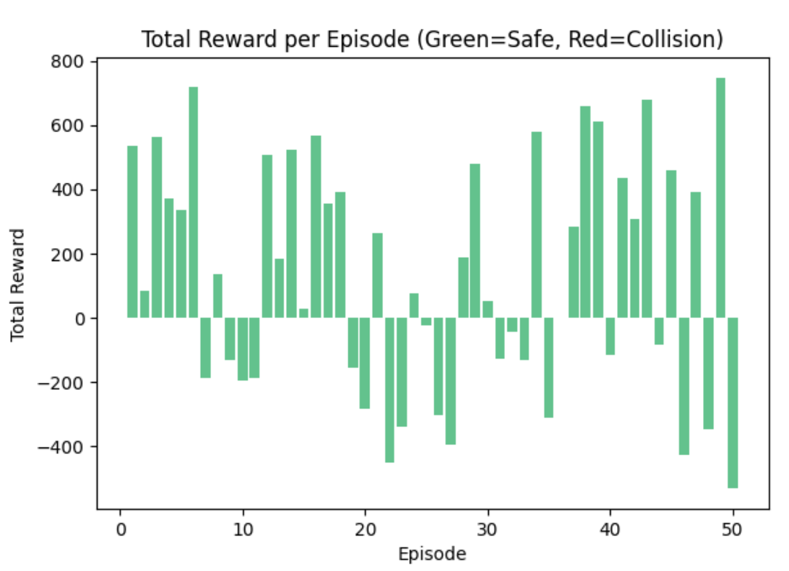
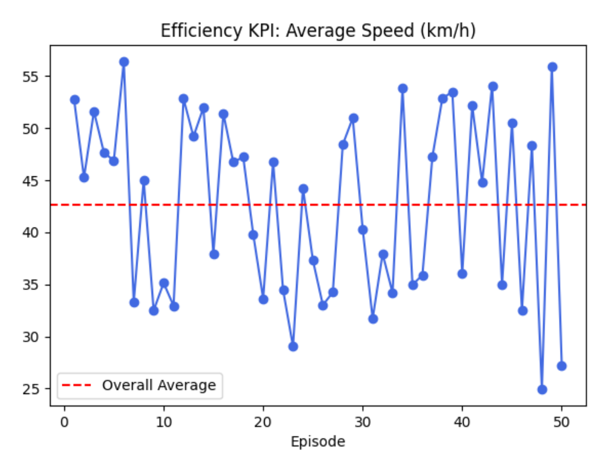
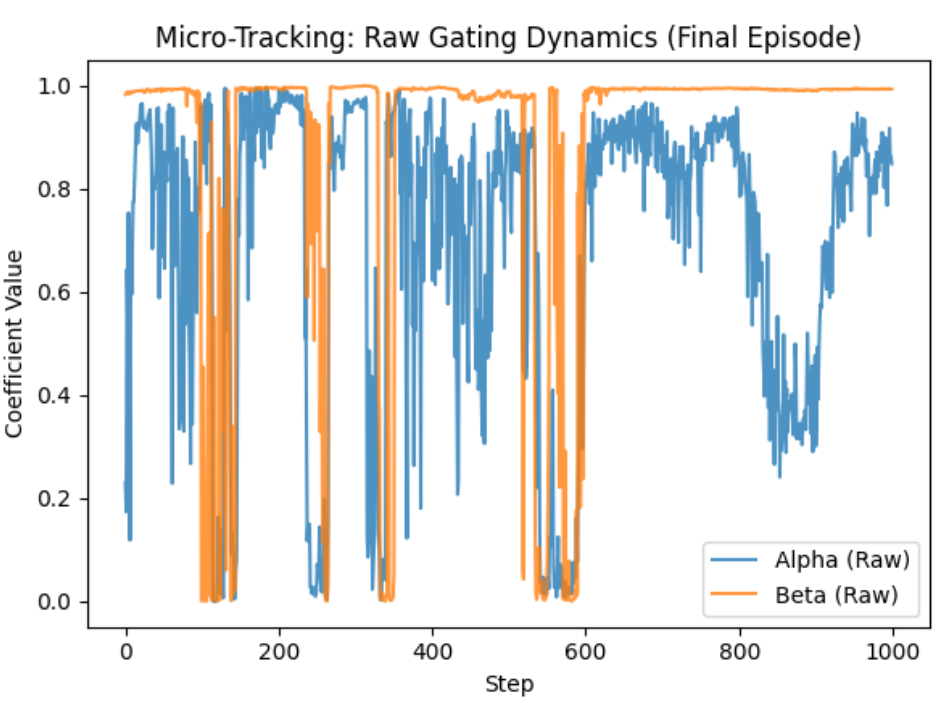

# GreyBox-Drive: Deterministic Safe Autonomous Navigation via Hybrid-Driven RL
A Hybrid-Driven RL architecture for deterministic safe autonomous navigation in high-density traffic.

## System Demonstration

https://github.com/user-attachments/assets/c48cf350-effa-4b9c-875b-2185e02dfd57

## Abstract

End-to-End Deep Reinforcement Learning (DRL) often struggles with the "sim-to-real" gap due to a lack of absolute deterministic safety constraints, which is fatal for industrial robotics deployment. GreyBox-Drive introduces a Hybrid-Driven control architecture engineered for highly congested, dynamic environments. 

Instead of directly outputting raw actuator commands, our Soft Actor-Critic (SAC) agent dynamically arbitrates "Confidence Gating Weights". This allows the system to gracefully yield control authority to deterministic kinematics (IDM & Stanley) during standard maneuvers, while reclaiming authority via rapid neural reflexes to navigate extreme multi-agent bottlenecks.

## Core Architecture Design

The system is built upon decoupled architectures to ensure robust sim-to-real potential:

1. Continuous Gating Arbitration (Alpha & Beta):
   * Longitudinal (Alpha): Dynamic arbitration between RL game-theoretic acceleration and the Intelligent Driver Model (IDM).
   * Lateral (Beta): Dynamic arbitration between RL evasion paths and Stanley Kinematic Controllers.
2. Spatiotemporal Encoding via Decoupled Critics:
   To strictly adhere to the mathematical bounds of the SAC algorithm and eliminate overestimation bias in dense multi-agent observations (handling up to 15 dynamic NPCs), the Double-Q networks utilize fully independent and decoupled Transformer Encoders.
3. Raw Neural Reflexes:
   The architecture is optimized to operate without heavy signal conditioning. By bypassing extensive post-processing delays, the agent achieves zero-latency neural reflexes during critical collision-avoidance events.

## Evaluation & Dynamics Analysis

The fully converged agent was evaluated over 50 continuous, high-stress episodes in CARLA (10Hz Sync Mode), featuring aggressive NPCs and complex lane topologies.This evaluation focuses on validating the fundamental robustness of the geometric safety shield and the dynamic gating mechanisms of the hybrid architecture. 

Core Performance Indicators (KPIs):

* 1. Absolute Safety (Total Reward): Achieved a strict 100.0% Collision-Free Rate across all 50 evaluation runs, proving the deterministic limits of the Grey-Box architecture.
* 2. Traffic Efficiency (Speed): Sustained optimal average speeds (~40-55 km/h) despite heavy traffic congestion. This demonstrates that the 100% safety rate is not achieved through overly conservative driving or freezing.
* 3. Micro-Tracking Gating Dynamics: The raw Alpha and Beta authority tracking reveals decisive, highly dynamic switching between the neural network and rule-based controllers, visually validating the core hybrid-driven concept.

  
  
  

## Author

Tao Wang
* M.Eng. in Mechanical Engineering
* Focus: Industrial Robotics, Multi-Agent Reinforcement Learning (MARL), and Real-World Deployable Control Systems.
* Contact: wang_tao_1995@outlook.com
